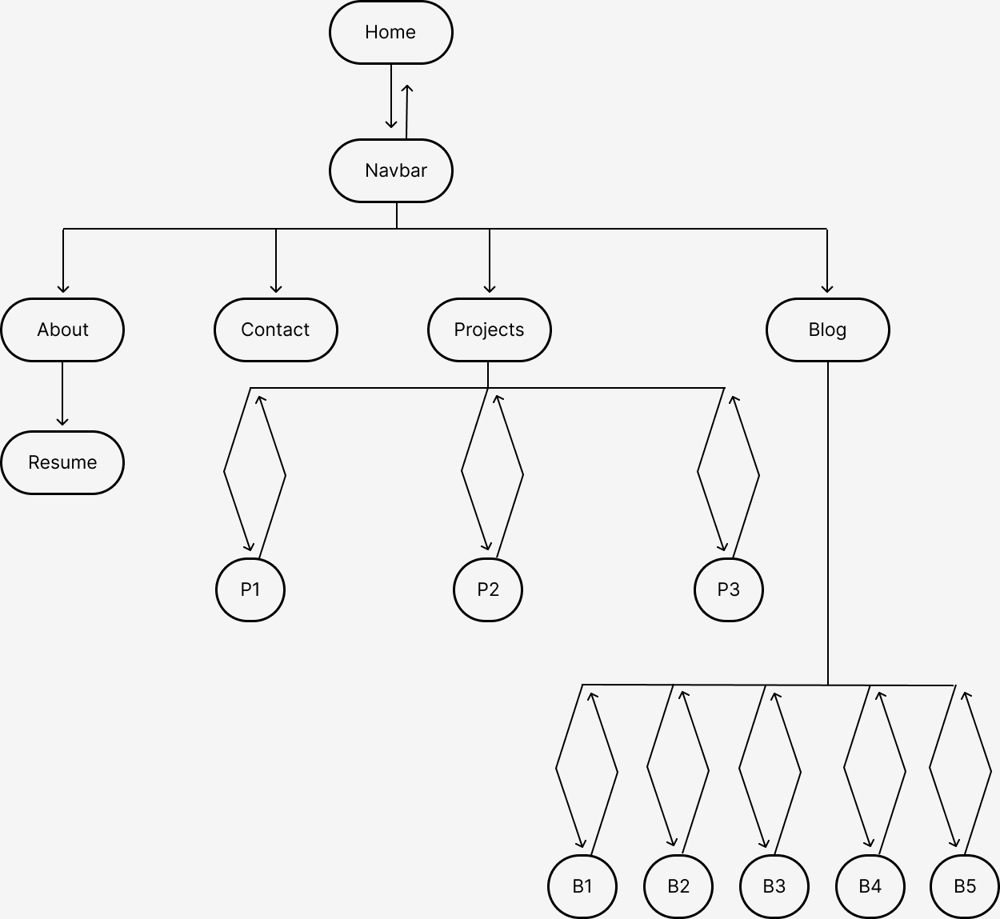

# BenjaminSmith_T1A2

## Link (URL) to your published portfolio website
https://dannyphan7om.github.io/BenjaminSmith_T1A2/

## GitHub repo
https://github.com/DannyPhan7om/BenjaminSmith_T1A2

## Description of your portfolio website

### Purpose
The purpose of my Portfolio website is to allow me to have a digital space to display my work, this space needs to represent the quality of my work and be easy to navigate. By creating this I can ensure to put my best foot forward when searching for clients or looking for future employment

### Functionality / features

For my site I have chosen a muted colour pallate that consists of deep navy, gold and a pale blue throughout as the text font. All buttons on the site have some interactive element to make it intuitive for the user including reducing the opacity to 80% on hover, changing the color of the text to gold etc. 

I chose to go with this theme as I believe these colours convey luxury and warmth, coupled with an element of fun. This is a feeling I want to pass on to those who are viewing my site.

The header of my website is consistent across all pages except for the name of the page, starting from the left you have my logo which I have linked back to the homepage for easy navigation. followed by the page name and on the right hand side my navigation icons. 

This is a responsive navbar meaning as the screen width is reduced the navbar becomes a collapsable dropdown menu controlled by selecting an Icon provided by FontAwesomne.

All main sections of my site are set up utilisig flexbox, they vary in sections from 1-3 and are set up using a combination of row and column configurations to ensure they remain responsive as you will see in the images attached below as well as my guided presentation.

The footer of my website also remains consistent across all pages, there are 2 Icons provided by FontAwesomee on either side of some text, these icons have been set up with a scale animation on hover and they change colour for interactivity.

### Screenshots

### Sitemap

### Wireframes

### Target audience

My target audience for this site include potential clients who need websites built, employers who need to view my work as well as the examiners at Coder Academy grading this assessment.

### Tech stacks used

* HTML
* CSS
* Github Deployment

https://vimeo.com/929047177?share=copy

